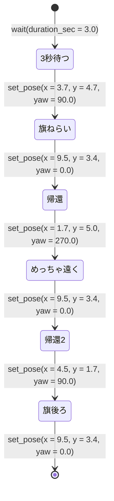

```mermaid
stateDiagram-v2

[*] --> 3秒待つ : wait(duration_sec = 3.0)
3秒待つ --> 旗ねらい : set_pose(x = 3.7, y = 4.7, yaw = 90.0)
旗ねらい --> 帰還 : set_pose(x = 9.5, y = 3.4, yaw = 0.0)
帰還 --> めっちゃ遠く : set_pose(x = 1.7, y = 5.0, yaw = 270.0)
めっちゃ遠く --> 帰還2 : set_pose(x = 9.5, y = 3.4, yaw = 0.0)
帰還2 --> 旗後ろ : set_pose(x = 4.5, y = 1.7, yaw = 90.0)
旗後ろ --> [*] : set_pose(x = 9.5, y = 3.4, yaw = 0.0)


```