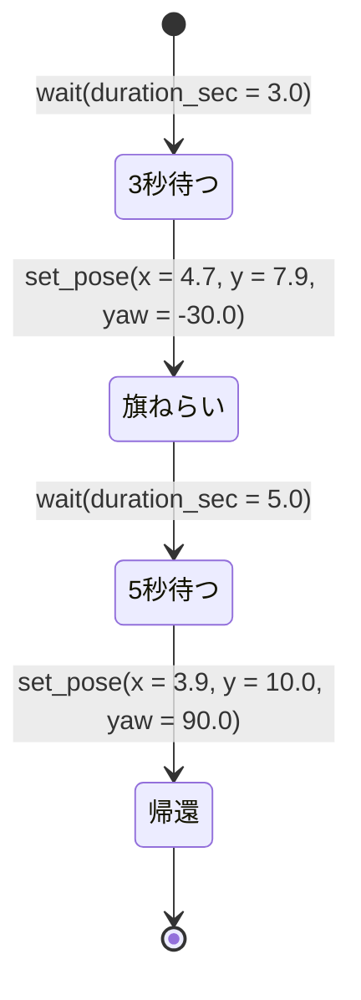

```mermaid
stateDiagram-v2

[*] --> 3秒待つ : wait(duration_sec = 3.0)
3秒待つ --> 旗ねらい : set_pose(x = 4.7, y = 7.9, yaw = -30.0)
旗ねらい --> 5秒待つ : wait(duration_sec = 5.0)
5秒待つ --> 帰還 : set_pose(x = 3.9, y = 10.0, yaw = 90.0)
帰還 -->  [*]

```
