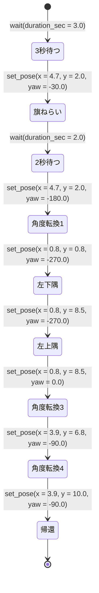

```mermaid
stateDiagram-v2

[*] --> 3秒待つ : wait(duration_sec = 3.0)
3秒待つ --> 旗ねらい : set_pose(x = 4.7, y = 2.0, yaw = -30.0)
旗ねらい --> 2秒待つ : wait(duration_sec = 2.0)
2秒待つ --> 角度転換1  : set_pose(x = 4.7, y = 2.0, yaw = -180.0)
角度転換1 --> 左下隅 : set_pose(x = 0.8, y = 0.8, yaw = -270.0)
左下隅 --> 左上隅 : set_pose(x = 0.8, y = 8.5, yaw = -270.0)
左上隅 --> 角度転換3 : set_pose(x = 0.8, y = 8.5, yaw = 0.0)
角度転換3 --> 角度転換4 : set_pose(x = 3.9, y = 6.8, yaw = -90.0)
角度転換4 --> 帰還 : set_pose(x = 3.9, y = 10.0, yaw = -90.0)
帰還 --> [*]

```
